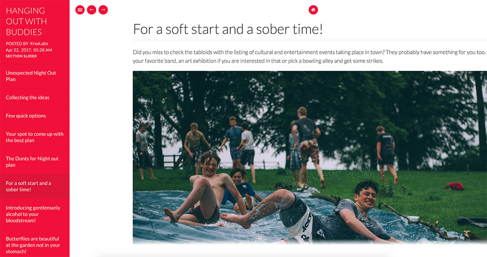

## Content Slider for WP Posts (Section Slider)
_Display long posts interactively._



### Overview
Content Slider for WP Posts (or Section Slider) is a content slider plugin for WordPress that helps you display long posts in a interactive slider. The plugin allow you to create multiple sections within your post. These sections are extracted and converted into a content slider page by the plugin. The plugin uses `Aside` post format by default and rename it to special post format called `Deck`. All posts that uses post format as `Deck` are treated as a special content post.

### Requirements
PHP: v5.4.0+
WordPress: v3.8+
Browsers: All modern browsers and IE10+

## Features ##
1. Simple shortcode `section` to separate different sections within a post.
2. Special post format `Deck` for the slider.
3. Fully extendable.
4. Can be used seamlessly in older posts.
5. Light weight and Responsive.
6. Hot key navigation (left and right arrow key)
7. Translation and customization ready.

### Installation
  1. Unzip and upload the `section-slider` directory to the plugin directory (`/wp-content/plugins/`) or install it from `Plugins->Add New->Upload`
  2. Activate the plugin through the `Plugins` menu in WordPress.

### Creating Content Slider
1. After successful plugin activation go to `add` or `edit` posts page and you will notice a new post format called `Deck`.
2. Choose `Deck` post format for the page.
3. Create sections as below.
   ```
   [section title='My section']
   ...content for your section goes here
   [/section]
   ```
   > If you don't specify title, the plugin will generate title automatically.

4. Click `publish` or `update` to save changes.

### Available Filters

##### Change TOC Auto Section Title Prefix
```php
add_filter( 'ss_section_prefix', function () {
    return 'Page';
} );
```

##### Change Section Heading Template
```php
add_filter( 'ss_section_heading_template', function () {
    return 'Page {{current_page}}/{{total_page}}';
} );
```

`{{current_page}}` and `{{total_page}}` will be replaced by current page number and total pages respectively.

### Creating Custom Template
To create a template, simply add a new folder in `templates` directory of the plugin. All templates must  have `layouts.php` file which defines your template layout (see default template for example). Now create a file called `Functions.php` that will extend `SS_Abstract_Template` class. This is the place where you will load required assests or meta data for your template.

```php
namespace SectionSlider\TemplateFiles;

use SectionSlider\Section_Slider;
use SectionSlider\Template\SS_Abstract_Template;

class Functions extends SS_Abstract_Template
{
    const TEMPLATE_NAME = 'your-template-name';

    /**
     * {@inheritdoc}
     */
    public function ss_add_template_resources()
    {
        ...

        //enqueue styles
        wp_enqueue_style(
            'your-template-styles',
            $this->styles_path . 'ss-your-template-styles.css',
            ['your-style-dependencies'],
            Section_Slider::VERSION
        );

        //enqueue scripts
        wp_enqueue_script(
            'your-template-scripts',
            $this->scripts_path . 'your-template-scripts.js',
            [ 'your-script-dependencies' ],
            Section_Slider::VERSION,
            true
        );

        ...
    }
}

/** Initialize template functions */
$ss_template_functions = new Functions();
```

All of the required data for your template will be available in a variable called `$section_data` inside your template. After you are done with the template or initial setup, you can tell the plugin to use your custom template as below:
```php
add_filter( 'ss_filter_template_path', function () {
    return SS_PLUGIN_DIR . 'templates/my-custom-template/';
} );
```

### Translation Guidelines
The translations live in the `languages` folder.

If you are interested in translating the plugin in your language, first make sure if the translation is not already available. The name of the file is important because there’s a particular format you should follow for consistency. For example, if you’re translating Nepali for Nepal, the file should be `section-slider-ne_NP.po` – `section-slider` for the plugin itself, `ne` for the language and `NP` for the country.

### Questions about this project?
Please feel free to report any bug found. Pull requests, issues, and plugin recommendations are more than welcome!
